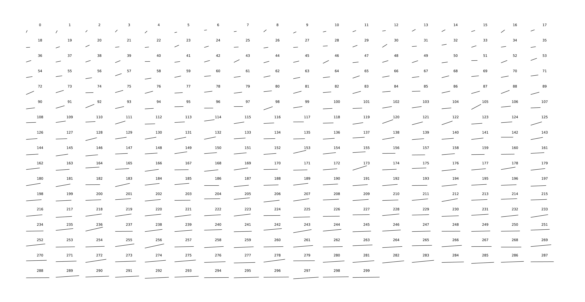

# Essex County, Mass. Public Schools

In-Progress

This repository features a project about the demographics and educational attainment differences between public school districts in Essex County and the distances between these districts.

## Essex County School Distances Repository
This sub-folder features a notebook, [essex_county_school_distances.ipynb](ec_school_distances/essex_county_school_distances.ipynb) that calculates the distance between each high school location using the Haversine formula with gps coordinates and matches the locations with each town name of residents attending each high school.

## Essex County School Data Repository
This sub-folder features two notebooks. [essex_county_public_schools_data.ipynb](ec-school-data/essex_county_public_schools_data.ipynb) merges datasets from the Massachusetts Department of Education (DOE) and U.S. Census Bureau data for school districts and towns in Essex County. [essex_county_public_schools_two_towns.ipynb](ec-school-data/essex_county_public_schools_two_towns.ipynb) compares this data to the distances between school district locations. 

## Essex County School Graphics Repository
This sub-folder features a notebook, [essex_county_public_schools_graphs.ipynb](ec_school_graphics/essex_county_public_schools_graphs.ipynb) that graphically explores the demographic, educational, and distance data— continuing what began in the two towns notebook. 

## Essex County School Districts Google Maps API Repository
This sub-folder includes a html document, [ec_schools_google_maps_api_copy.html](ec-school-districts-google-maps-api/ec_schools_google_maps_api_copy.html), which uses the Google Maps API (with the key removed) to plot the school district locations on Google Maps

